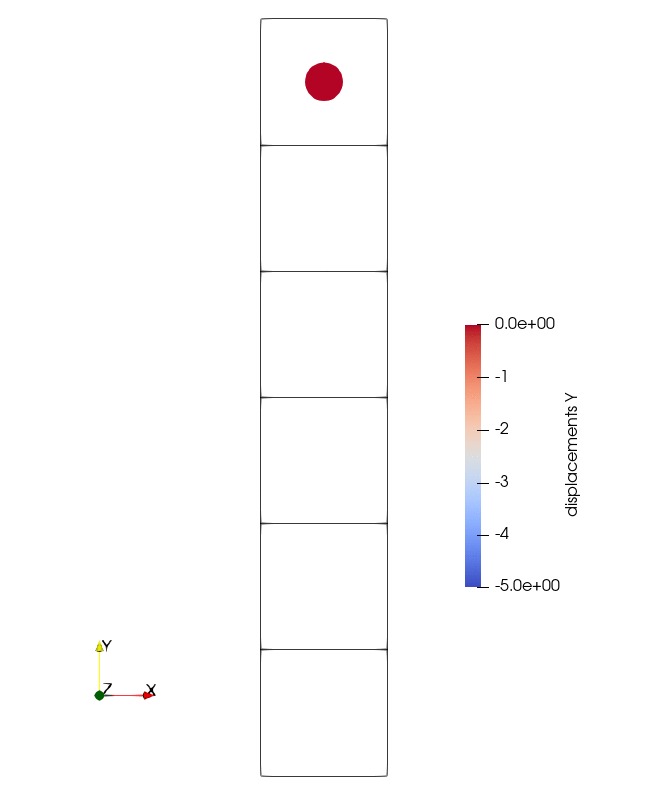
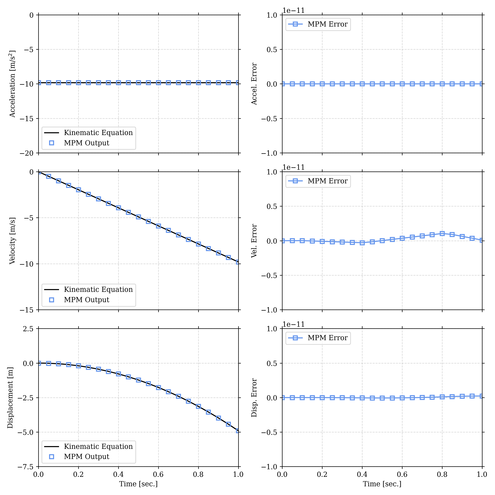

# Free Falling Body

## Description

Consider a body initially at rest that experiences a constant accelerated due to gravity. For this body in free fall, the classic kinematic equations can be used to validate the implemented Forward Euler explicit time integration. 

The true displacement, velocity, and acceleration are:
```
a = -9.81                           [m/(s*s)]
v = v_0 + (a * t)                   [m/s]
u = (v_0 * t ) + (0.5 * a * t * t)  [m]
```

<p align="center">
  
</p>

## Results

Acceleration is imposed; therefore error is exactly zero. 

Velocity indicates very small errors (with max error on the order of 1e-12). Prior to any cell crossings, the velocity error is even smaller. 

Displamcent errors remain small for all time considered, but are always non-zero (on the order of 1e-13). 

Overall low error indicates successful implementation. 

<p align="center">
  
</p>
