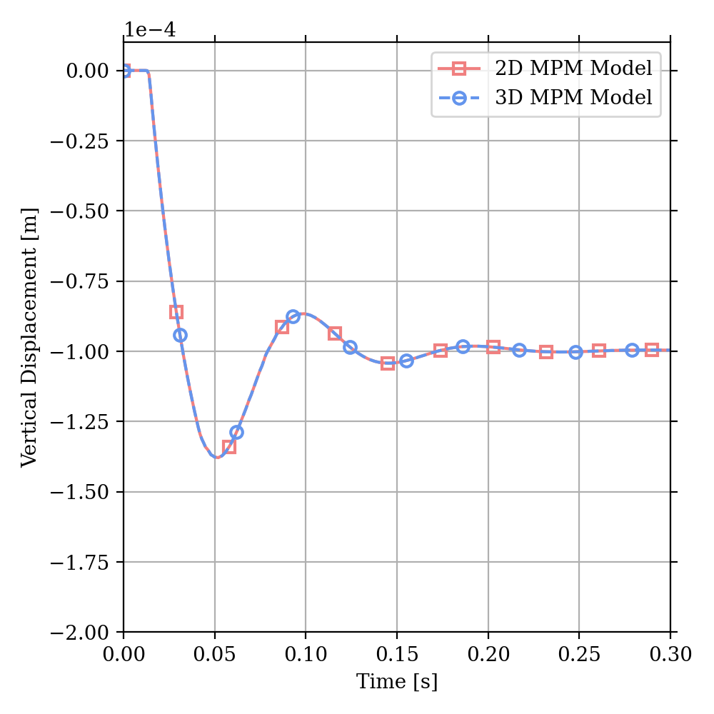

# Uniaxial Absorbing Boundary

## Description

Kelvin-Voigt elements are an improvement over pure dashpot boundaries since the issue of countinuous dashpot creep is solved. 

Consider a 1D column of linear elastic material with a Kelvin-Voigt boundary condition along the column base. When loaded with a constant stress applied at the top of the column, the displacement at the column base is 
```
u = sigma * delta / M
```
where `u` is the displacment, `sigma` is the applied stress, `delta` is the thickness of the virtual viscous layer, and `M` is the constrained modulus. 

Validating the displacement at the bottom of a 1D column is completed using both 2D and 3D MPM models. The following elastic material paramters are considered for both 2D and 3D models
```
parameter             | units | value
----------------------------------------
Poisson ratio         |       | 0.0
Young's modulus       |    Pa | 100e3
virtual viscous layer |     m | 0.10
applied traction      |    Pa | 100.0
```
leading to expected displacement of `u=1e-4 [m]`.


## Results

As the column reaches steady state, the base displacement approaches `u=1e-4 [m]` for both the 2D and 3D MPM models. This is one indication that the Kelvin-Voigt boundary conditions are accurately implemented. 

<p align="center">
  
</p>