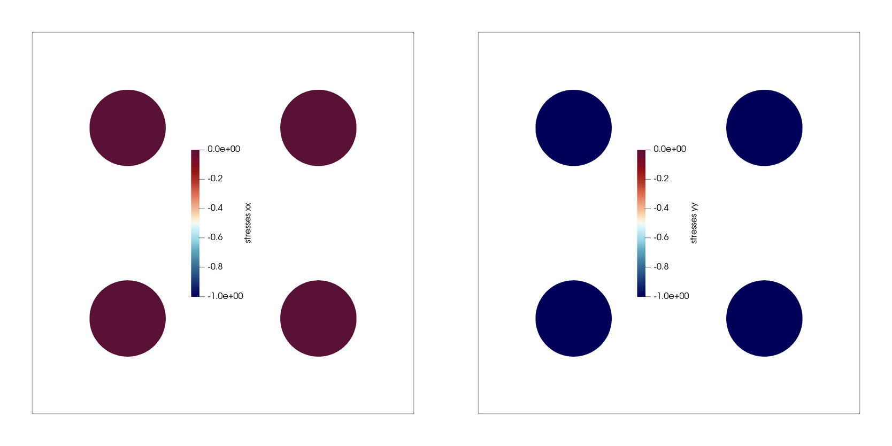

# Uniaxial Stress

## Description

Nodal velocity constraints are used to impose a uniaxial compressive strains. The prescribed nodal velocity is `v = -0.01 [m/s]`. The final time is `tf = 0.1 [s]`. Basic kinematic equations stipulate that `dx = -0.001 [m]`. The domain is initially `1 x 1 [m]`; thus, strain is `epsilon = -0.001`. 

Consider a 1D column of linear elastic material. The stress in the body is
```
sigma = epsilon * E
```
where `sigma` is the uniaxial stress, `epsilon` is the uniaxial strain, and `E` is the Young's modulus. 

The following elastic material parameters and strain magnitude are considered
```
parameter       | units | value
----------------------------------
Poisson ratio   |       | 0.0
Young's modulus | Pa    | 1000.0
epsilon         |       | -0.001
```
leading to expected stress of `sigma = -1 [Pa]` 

## Results

The numerical time-step is `dt = 0.01 [s]`. Below provides visualization of numerical outputs after 10 steps: vertical stress is `sigma_yy = -1 [Pa]` and horizontal stress is `sigma_xx = 0 [Pa]` due to the uniaxial condition. 

<p align="center">
  
</p>

## Benchmark

The `test_benchmark.py` file checks the `xx` and `yy` stress components. The vertical stress is `sigma_yy = -1 [Pa]` and the horizontal stress is `sigma_xx = 0 [Pa]` within an error of `1e-8 [Pa]`. 