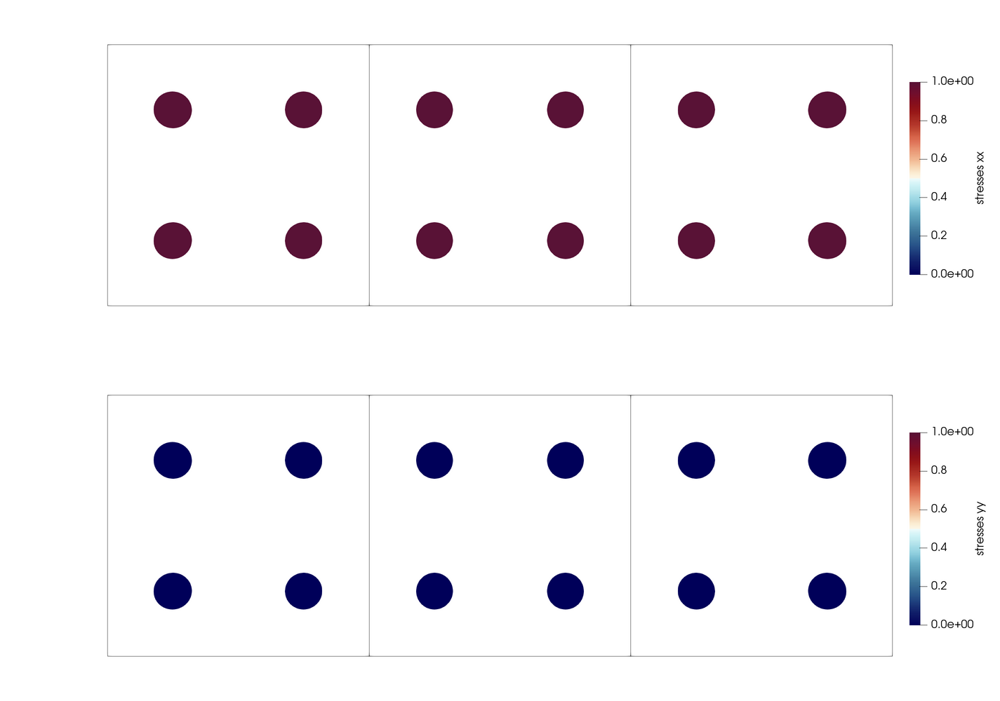
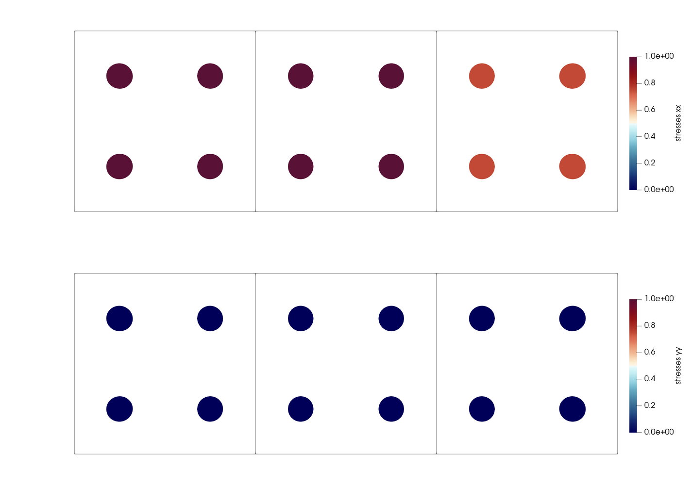

# Uniaxial Traction

## Description

Three methods are used to impose tensile stresses within a bar. The following elastic materials parameters are used
```
parameter       | units | value
----------------------------------
Poisson ratio   |       | 0.0
Young's modulus | Pa    | 1.0e+6
```

### Nodal Forces
Based on the known mesh geometry, the boundary traction (`1 [Pa]`) is converted into nodal forces. Concentrated nodal forces are defined within the `input.json`. The utilized math function ramps up the nodal forces over the first 500 steps; the load is held constant over the final 500 steps. 

### Nodal Forces (from File)
Based on the known mesh geometry, the boundary traction (`1 [Pa]`) is converted into nodal forces. Concentrated nodal forces are defined in an external `nodal-force.txt` file and read into the `input.json`. 

> No math function is utilized when applying concentrated nodal forces with an external `.txt` file. As a result, internal stresses initially oscillate from the sudden force imbalance. 

### Particle Traction 
The boundary traction (`1 [Pa]`) is directly applied to the right-most material points. The traction is defined within the `input.json`. The utilized math function ramps up the nodal forces over the first 500 steps; the load is held constant over the final 500 steps.

## Results
Final internal stresses are equivalent for both methods of applying the boundary traction with concentrated nodal forces. Below provides a visualization of numerical outputs after 1000 steps: horizontal stress is `sigma_xx = 1 [Pa]` and vertical stress is `sigma_yy = 0 [Pa]`.

<p align="center">
  
</p>

Final internal stresses incur errors when applying the boundary traction directly to the right-most material points. Below provides a visualization of numerical outputs after 1000 steps: horizontal stress ranges from about `sigma_xx = 0.75 [Pa]` to `sigma_xx = 1 [Pa]` and vertical stress is `sigma_yy = 0 [Pa]`.

<p align="center">
  
</p>

## Benchmark
The `test_benchmark.py` file checks the `xx` stress component at various incremental outputs.

For loading with the concentrated nodal forces, the horizontal stress is `sigma_xx = 1 [Pa]` within an error of `1e-5 [Pa]`.

For loading with the particle tractions, the maximum horizontal stress (material points in the left-most element) is `sigma_xx = 1 [Pa]` within an error of `1e-6 [Pa]` while the material points in the right-most cell incur large errors. 

>Very specific values of `sigma_xx` are included within `test_benchmark.py` for checking the uniformity of the code during nightly testing. 